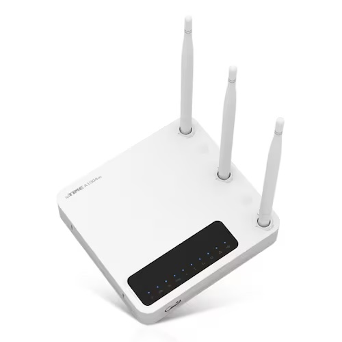

# Conversion Firmware to Ubuntu

Test Firmware

[IPTime 1004NS](https://iptime.com/iptime/?page_id=126&dfsid=3&dftid=321&uid=24857&mod=document)
[](https://prod.danawa.com/info/?pcode=3900519)

CPU Architecture : MIPS with Little Endian

testing based on [Debian](https://github.com/jubinson/debian-rootfs) 

```
$ sudo apt update
$ sudo apt install -y multistrap binfmt-support binfmt-support qemu-user-static debootstrap qemu-system-mips binwalk

# wget https://download.iptime.co.kr/online_upgrade/a1004ns_ml_12_152.bin
$ cp ./resources/a1004ns_ml_12_152.bin .

# wget https://www.dropbox.com/s/m80krqbeb09g2ht/mips-rootfs-20170318T103202Z.tar.gz?dl=1 && mv mips-rootfs-20170318T103202Z.tar.gz mips-rootfs.tar.gz
# origin from https://github.com/jubinson/debian-rootfs
$ cp ./resources/mips-rootfs.tar.gz .

$ sudo binwalk ./a1004ns_ml_12_152.bin # if you want to see detail of binary.
$ sudo binwalk -e ./a1004ns_ml_12_152.bin --run-as=root
$ sudo mkdir ./_a1004ns_ml_12_152.bin.extracted/squashfs-root/root
$ sudo tar -zxf mips-rootfs.tar.gz -C ./_a1004ns_ml_12_152.bin.extracted/squashfs-root/root

$ cd ./_a1004ns_ml_12_152.bin.extracted/squashfs-root/
$ sudo mv ./root/mips-rootfs-20170318T103202Z ./root/mips-rootfs
$ sudo cp /usr/bin/qemu-mipsel-static ./

$ sudo chroot . ./qemu-mipsel-static ./bin/ash

# chroot ~/mips-rootfs
```
